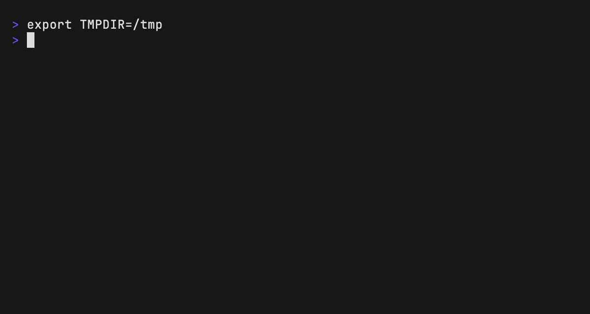

# Burn Before Reset 🔥

[](https://github.com/steven-pku/burn-before-reset/actions/workflows/tests.yml)
[](LICENSE)
[](pyproject.toml)

English · [中文](./README.zh-CN.md)

**Don’t burn tokens. Burn down your backlog.**

Burn Before Reset turns expiring subscription quota into useful, reviewable work the agent finds on its own — from session logs, repositories, and documents — then hard-stops before a user-supplied outer reset. A closed inner allowance window pauses the run; only the outer reset ends it.

It indexes only sources you explicitly allow, builds a traceable candidate list, freezes a bounded queue, checkpoints every task, and produces one Morning Report. Token use is a constraint, not a KPI.



The demo above is generated from [assets/demo.tape](assets/demo.tape) with [vhs](https://github.com/charmbracelet/vhs) — plan-only, against throwaway demo sources.

**Contents**: [Status](#current-status) · [Safety model](#safety-model) · [Quick start](#quick-start) · [Exit codes](#exit-codes) · [What v0.2 does](#what-v02-does) · [What it does not do](#what-it-does-not-do) · [Layout](#repository-layout) · [Agents](#which-agents-can-run-this) · [License](#license)

## Current status

**Public candidate. Not proven safe for unattended use.**

Lifecycle is `candidate`. Three real Codex tasks have run end to end through the product adapter across two source types, and the deadline guard has been observed killing a live Codex process group, so `PROMOTION_GATE` is satisfied at 3 of 3. Nothing here is installed globally, and `verified` is still not claimed: that also requires a decision about installation targets.

Read that as: the safety machinery is tested, the happy path has been exercised, and the hard stop has actually fired once against a real process — all on small, non-sensitive sources in `safe` mode, under supervision. `balanced` mode has never run for real. The default path is plan-only, and it should stay that way until you have watched `--execute` behave on your own sources. See [VALIDATION.md](VALIDATION.md) for the full gate ledger and the risks that remain open.

## Safety model

- User supplies an absolute reset timestamp with timezone.
- Default hard stop is fifteen minutes before reset; values below ten minutes are rejected.
- Execution becomes mechanically plan-only inside sixty minutes of the hard stop.
- Unknown Credits balance, unknown Auto top-up state, API-key environment variables, or billing/rate-limit errors fail closed.
- Environment variables that could supply a key or redirect the endpoint are withheld from the Worker and listed in `DROPPED_ENV.txt`. Proxy variables are kept: they change the network route, not the billed account.
- Billing and auth failures are read from the Worker's diagnostics, never from the artifact it wrote. An artifact that merely discusses pricing or rate limits is still delivered.
- Planner never modifies source roots, and reads Git status without touching the repository index.
- No delete, push, merge, deploy, publish, message, purchase, credential change, provider fallback, or Cloud Task.
- A supervised watchdog controls the local worker process group; guard loss or unconfirmed shutdown fails the task.
- Each round's queue freezes before it is worked and is never added to; a drained queue with time left triggers a fresh frozen round, and a round that finds nothing ends the run instead of inventing work.
- Worker prompts omit source snippets and treat locator metadata as untrusted data, not instructions.
- Rehashed queues still reject unsafe task IDs and deliverable traversal; runtime task roots are rebound to configured sources and the current run directory.
- Only a completed Worker `agent_message` that passes every safety check is promoted into `artifacts/`; failed output stays diagnostic.

Important: Codex's standard sandbox constrains writes but does not provide a repository-specific read allowlist. Until stronger OS-level confinement is validated, use `plan` for sensitive data and treat `--execute` as an isolated pilot.

## Quick start

Requires Python 3.11+, Git, and a locally authenticated Codex CLI or Claude Code CLI (set `execution.provider`).

```bash
cp examples/config.example.toml config.local.toml
# Edit config.local.toml first: replace the /absolute/path/to/... placeholders
# with your real source roots, and point output_root somewhere durable.
python3 scripts/bbr.py validate-config --config config.local.toml
python3 scripts/bbr.py plan --config config.local.toml
```

`validate-config` refuses placeholder paths with exit `2` — that is the gate working, not a bug. Once it prints `"valid": true`, `plan` writes a run directory under `output_root`.

Review the generated `RUN_PLAN.md`, `CANDIDATES.jsonl`, and frozen `QUEUE.json` before any Worker run.

Execution is deliberately double-gated:

```bash
python3 scripts/bbr.py run --config config.local.toml --execute
```

The command still refuses unless `execution.enabled = true` and every safety assertion passes.

## Exit codes

`run` reports whether the queue was worked to the end, not merely whether the process survived. Wrap it accordingly.

| Code | Meaning |
|---|---|
| `0` | The queue was exhausted with no failed task. This is the only success. |
| `1` | The run stopped early. Read `STOP_REASON`: `deadline_guard` and `drain_window` are correct, designed stops with work left over; `billing_or_auth_error`, `source_mutation_detected`, `guard_failure`, and `stop_unconfirmed` are not. |
| `2` | The command refused before doing anything: a gate failed, the config was rejected, or `--execute` was missing. |

A `1` from a deadline stop means "ran out of time as designed", so treat it as an incomplete run rather than a fault, and read `MORNING_REPORT.md` before deciding.

## What v0.2 does

- One up-front mode question — review the plan, or full autopilot — then hands-off.
- Source discovery without a note vault: `bbr discover` proposes session-log,
  repository, and document roots by recent activity, read-only.
- Riding inner allowance windows: on `usage limit`, the supervisor sleeps and retries
  the same task until the window reopens; only the outer `reset_at` is a hard stop.
- Re-planning rounds: a drained queue with usable time left is refilled from fresh
  signals; a round that finds nothing ends the run honestly.
- Strict preflight and deadline computation.
- Deterministic, allowlisted Markdown/session/repository indexing.
- Candidate extraction and value/risk scoring.
- Immutable frozen queue and atomic run state.
- Sequential local worker adapter — Codex CLI or Claude Code — with full event capture.
- Supervised deadline watchdog, confirmed-stop receipts, checkpoints, stop reason, and Morning Report even on ordinary Worker exceptions.
- Dry-run and fake-worker integration tests.

## What it does not do

- Read quota/reset data from undocumented endpoints.
- Guarantee server-side billing behavior.
- Use API keys, paid Credits, provider fallback, or cloud jobs.
- Mutate original Vaults or repositories.
- Integrate patches, open PRs, create remotes, or push.
- Invent filler tasks to burn quota: every task traces to a real signal in a real source.

## Repository layout

```text
SKILL.md                 Agent workflow and activation gate
scripts/bbr.py           Local CLI entry point
src/burn_before_reset/   Deterministic runner
references/              Risk, task contract, adapters, research
task-packs/              Bounded candidate-generation recipes
schemas/                 Task and run-state contracts
tests/                   Unit and integration tests
examples/                Safe configuration example
.agents/skills/          Skill discovery for Codex CLI
.claude/skills/          Skill discovery for Claude Code
```

Both skill directories hold a symlink back to the repository root, so a session started
inside this checkout finds `SKILL.md` with no global install. The two exist because the
agents look in different places: Codex reads `.agents/skills/`, Claude Code reads
`.claude/skills/` in the working directory and every parent up to the repository root.
Git checkouts on Windows without symlink support materialise them as text files
containing `../..`; the CLI and the tests are unaffected.

## Which agents can run this

The Skill file itself is portable — plain `SKILL.md` with `name` and `description`
frontmatter — and both Codex CLI and Claude Code discover it from this checkout.

**Two worker adapters ship.** `execution.provider = "codex"` shells out to
`codex exec` under its sandbox (`safe` or `balanced`). `execution.provider = "claude"`
shells out to Claude Code headless, `safe` mode only: the worker is launched with
`--safe-mode`, an empty strict MCP configuration, and nothing beyond Read/Grep/Glob —
read-only because the write tools are absent, not merely denied. Running out of
allowance mid-run ends the run as `quota_exhausted`, an ordinary stop distinct from
`billing_or_auth_error`. Other agents can still *discover* the Skill without being able
to *execute* it — read the boundary before assuming "works with my agent" means "runs
with my agent".

See [SECURITY.md](SECURITY.md) before enabling execution and [research-2026-08-24.md](references/research-2026-08-24.md) for the evidence and competitor comparison.

## License

MIT — see [LICENSE](LICENSE).
