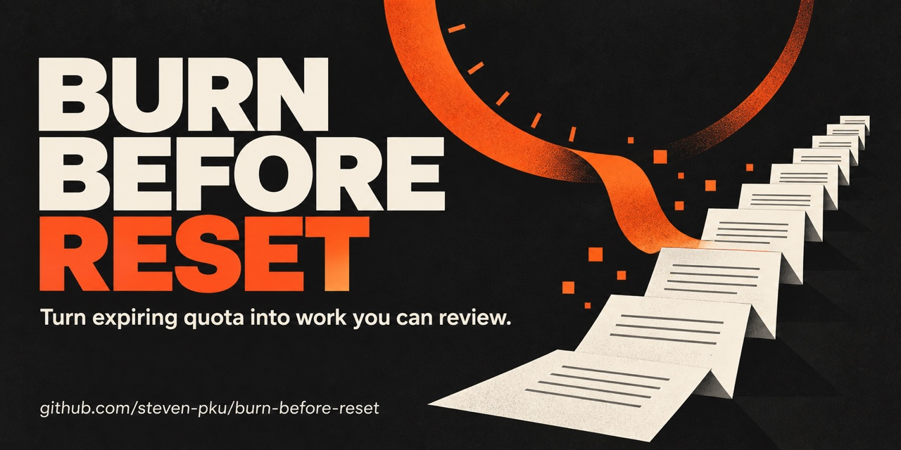

# Burn Before Reset 🔥

[](https://github.com/steven-pku/burn-before-reset/actions/workflows/tests.yml)
[](LICENSE)
[](pyproject.toml)

English · [中文](README.zh-CN.md)

**Don’t burn tokens. Burn down your backlog.**

Turn expiring Codex or Claude Code subscription quota into local work you can review: decision briefs, claim reviews, blocker analyses and patch plans. Burn Before Reset finds candidates in sources you select, runs a bounded queue, and stops before your confirmed reset time or an independent runtime ceiling.

**Public candidate. Start with the no-model demo below.** Execution has been exercised on one machine; it is not proven safe for unattended use with sensitive data. [Evidence and remaining limits](VALIDATION.md).


*Sample data, not a real run or a value claim.* The self-contained report groups artifacts, links to their source, and lets you prepare a handoff brief. Adding an item to the list sends nothing; copy the brief to your agent when you want to continue.

[Try it](#try-it-without-a-model) · [Run real work](#run-real-work) · [Safety](#safety-model) · [Evidence](#current-status) · [Contribute](CONTRIBUTING.md) · [Security reports](SECURITY.md)

## Try it without a model

Requires **Python 3.11+ and Git on macOS or Linux**. No Python dependencies, account login, model CLI or quota are needed for the demo.

```bash
git clone https://github.com/steven-pku/burn-before-reset.git
cd burn-before-reset
python3 scripts/demo.py
```

Expected output starts with `DEMO READY — no model, login or quota used`. Open the printed `Sample report` path in your browser; `REPORT.zh.html` beside it is the Chinese version. The separate `Plan` directory contains a real validated queue built from a throwaway source, which is checked to remain unchanged. Demo billing assertions are fictional; use the real template below for your own work.

<details>
<summary>See the reproducible terminal demo</summary>


Regenerate with `vhs assets/demo.tape` from this checkout. See the [tape](assets/demo.tape).
</details>

## Run real work

You also need a locally authenticated Codex CLI or Claude Code CLI. Commands below run **from this repository root**. Read [SECURITY.md](SECURITY.md) before enabling execution.

1. Copy `examples/config.example.toml` to `config.local.toml`.
2. Supply the actual reset time from your provider’s official usage UI, including timezone. Start within 24 hours of it. Choose `execution.provider = "codex"` or `"claude"`, set the source paths, and choose a durable output directory outside those sources.
3. Check your account and set the three billing assertions to `true` only when confirmed. Keep API keys, paid credits and fallback disabled. These are your assertions, not automated account checks.
4. Keep `execution.enabled = false` while planning. Set a small launch cap and task count for your first pilot. The template uses 20 launches and 3 tasks per round.

```bash
cp examples/config.example.toml config.local.toml
# Edit the fields above before continuing.
python3 scripts/bbr.py validate-config --config config.local.toml
python3 scripts/bbr.py plan --config config.local.toml
```

The unedited template intentionally refuses with exit `2`. A successful `plan` prints a run directory. Review its `RUN_PLAN.md`, `CANDIDATES.jsonl` and `QUEUE.json`. It has not called a model or produced completed artifacts.

Set `execution.enabled = true`, then choose **one** execution mode:

```bash
# Execute exactly the queue you reviewed. Replace the path with the printed directory.
python3 scripts/bbr.py run --config config.local.toml --run-dir /path/to/reviewed-run --execute

# Or explicitly authorize initial planning and follow-up rounds within the same bounds.
python3 scripts/bbr.py run --config config.local.toml --autopilot --execute
```

A reviewed queue never gains follow-up tasks, even when `replan_when_queue_empty = true`. Changes to the provider, sources, reset or limits require a new plan; enabling execution alone is allowed. Plans made before the configuration-binding feature must be regenerated. Every execution path still requires all safety gates to pass.

After execution stops, open `REPORT.html` or read `MORNING_REPORT.md` in the run directory. Use `STOP_REASON` and `events.jsonl` to investigate an incomplete run. Artifact completion means a worker result passed the runner’s checks; it does not certify that its conclusions are correct or useful.

## Safety model

- **Bounded time:** reset must be within 24 hours. `max_runtime_hours` defaults to 12 and cannot exceed 24. The earlier of that ceiling and reset minus the safety buffer is frozen in the plan. Reloading cannot extend it.
- **Early stop:** default safety buffer is 15 minutes; less than 10 is rejected. New execution is refused inside 60 minutes of the effective hard stop. Dispatch drains before that stop so task timeouts can fit.
- **Explicit cost boundary:** subscription-only assertions must be confirmed; API keys, paid credits and provider fallback are rejected. Credential and endpoint environment variables are withheld from workers. The tool cannot verify balances or guarantee server-side billing.
- **Local work:** the planner never writes to sources. Workers produce artifacts in a separate run directory. No push, merge, deploy, publication, messaging or purchase is part of the workflow.
- **Supervised workers:** a watchdog controls each local worker process group. Lost guards, attributable source writes and unconfirmed shutdowns stop the run. Between workers, the supervisor enforces the deadline.
- **Reviewable queues:** each queue is frozen and hashed. Reviewed mode uses one queue; explicitly selected autopilot may create fresh rounds. All attempts and quota retries count toward `max_worker_calls_per_run`.
- **Provider refusal:** recognized temporary allowance limits may pause and retry when enabled, within the deadline. Billing/auth errors stop the run. Textual matching cannot always distinguish an allowance limit from another rate limit.

Codex’s standard sandbox constrains writes but does not provide a project-specific read allowlist. Claude’s read tools also have a broader read boundary than the deterministic indexer. Treat execution as an isolated pilot and keep sensitive data outside the worker environment. See the complete [supported boundaries](SECURITY.md).

## Current status

**v0.3.2 — explicit execution modes and a no-model first-use demo.** See the [release notes](https://github.com/steven-pku/burn-before-reset/releases/tag/v0.3.2) and [changelog](CHANGELOG.md).

One real overnight exercise completed **25 tasks and produced 27 artifacts across three runs**. The CLI reported **$71.38 in estimated usage cost**, and the provider eventually refused further work. This does not establish a zero remaining balance. Dollar estimates are not subscription charges, savings or artifact value; [Claude’s cost documentation](https://code.claude.com/docs/en/costs#using-the-usage-command) explains the distinction. Human usefulness grades remain outstanding.

Real Codex tasks and a live deadline stop have also been observed; `balanced` mode has only one small real exercise. Tests and synthetic demos cover more scenarios, but are not evidence of reliable unattended operation across accounts and environments. Full receipts and known gaps are in [VALIDATION.md](VALIDATION.md).

## Exit codes

| Code | Meaning |
|---|---|
| `0` | Queue exhausted with no failed task. Review artifact quality separately. |
| `1` | Incomplete or failed run, or a completed queue that carries a failed task. Read `STOP_REASON`; deadline, drain and allowance stops can be expected outcomes. |
| `2` | Command refused or errored: configuration, execution mode, preflight or command failure. Read stderr; inspect any existing run receipts. |

## Agent support and repository layout

Start Codex CLI or Claude Code in this checkout to discover the repository-scoped Skill. `.agents/skills/` and `.claude/skills/` link back to the root `SKILL.md`; no global installation is needed. Windows execution is not supported or covered by CI.

Codex workers use `codex exec` with the selected sandbox (`safe` or `balanced`). Claude workers support `safe` only, using `Read,Grep,Glob`, `--restricted`, `--safe-mode` and an empty strict MCP configuration. These flags serve different purposes: safe mode disables customizations; it does not itself remove built-in tools. They are documented in the [Claude CLI reference](https://code.claude.com/docs/en/cli-reference) as of 2026-09-06; preflight still checks the installed CLI for every required flag.

| Path | Purpose |
|---|---|
| `SKILL.md` | Agent workflow, scope and authorization |
| `scripts/bbr.py` | Local CLI |
| `scripts/demo.py` | No-model first-use demo |
| `scripts/check.py` | Local and CI test entry point |
| `src/burn_before_reset/` | Planner, runner and reports |
| `examples/` | Real-run configuration template |
| `references/`, `task-packs/` | Source adapters, task contracts and recipes |
| `schemas/`, `tests/` | Machine contracts and regression checks |

## Help and contributions

Use [GitHub Issues](https://github.com/steven-pku/burn-before-reset/issues) for bugs and reproducible non-security findings. For boundary escapes or unintended billing, use [private vulnerability reporting](https://github.com/steven-pku/burn-before-reset/security/advisories/new). Read [CONTRIBUTING.md](CONTRIBUTING.md) for the same checks CI runs.

MIT — see [LICENSE](LICENSE).
