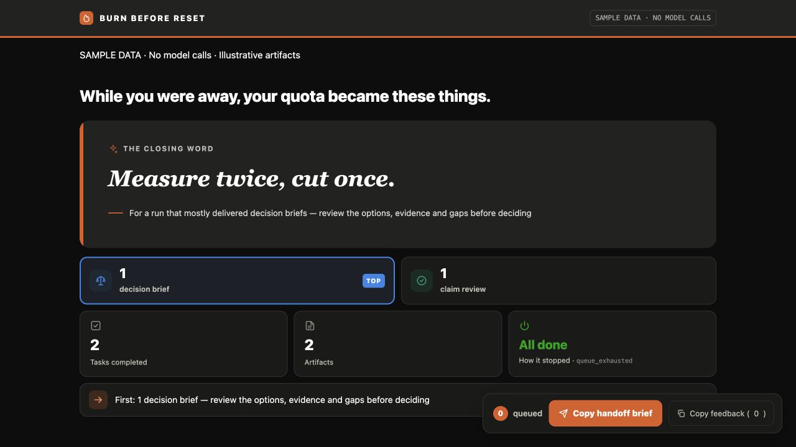

# Burn Before Reset 🔥

[English](README.md) · 中文

**别烧 token，烧掉你的积压。**

把即将重置的 Codex 或 Claude Code 订阅额度，转成可审阅的本地产物：决策分析、主张核验报告、堵点分析和补丁计划。工具从你指定的来源中找候选任务，按有界队列执行，并在确认的重置时间或独立运行上限之前停止。

**当前是公开候选版本。先体验不调用模型的演示。**真实执行主要在一台机器上验证，尚未证明可无人值守用于敏感资料。完整边界以英文 [README](README.md) 和 [SECURITY.md](SECURITY.md) 为准。



截图使用示例数据，不代表真实运行或成果价值。成果页支持中文；加入交办清单只做本地选择，复制给 agent 后才由你继续交办。

## 一条命令体验

需要 macOS 或 Linux、Python 3.11+ 和 Git。演示不需要模型 CLI、账号登录或额度。

```bash
git clone https://github.com/steven-pku/burn-before-reset.git
cd burn-before-reset
python3 scripts/demo.py
```

看到 `DEMO READY — no model, login or quota used` 后，打开输出路径里的 `REPORT.zh.html`。演示会另外生成一份经过校验的真实计划，确认示例源文件没有变化、执行开关仍关闭。演示中的计费断言是虚构的，不应拿来运行真实任务。

## 运行自己的任务

需要本地已登录的 Codex CLI 或 Claude Code。以下命令在仓库根目录执行。

1. 复制配置模板，填写从官方用量页面确认的重置时间及其时区；只允许在重置前 24 小时内启动。
2. 显式选择 `execution.provider` 为 `codex` 或 `claude`，填写允许读取的来源，输出目录应持久保存且与来源分离。
3. 确认订阅登录、Credits 余额为零、自动充值关闭后，才把对应断言改为 `true`。工具不会自动核验账号余额。
4. 保持 `execution.enabled = false`，先生成计划；首次实跑保留较小任务数与调用上限。

```bash
cp examples/config.example.toml config.local.toml
# 先编辑上述字段；未改动的模板会拒绝运行。
python3 scripts/bbr.py validate-config --config config.local.toml
python3 scripts/bbr.py plan --config config.local.toml
```

审阅输出目录里的 `RUN_PLAN.md`、`CANDIDATES.jsonl` 和 `QUEUE.json`。此时没有调用模型，也没有已完成产物。然后把 `execution.enabled` 改为 `true`，选择一种模式：

```bash
# 只执行刚刚审阅的队列；替换成实际输出路径。
python3 scripts/bbr.py run --config config.local.toml --run-dir /path/to/reviewed-run --execute

# 或明确授权自动规划及后续轮次。
python3 scripts/bbr.py run --config config.local.toml --autopilot --execute
```

审阅模式不会追加新任务；改变供应商、来源、重置时间或运行限制后，需要重新生成计划。旧版本没有配置绑定信息的计划也需重建。执行结束后查看 `REPORT.html`、`MORNING_REPORT.md` 和 `STOP_REASON`。

## 关键边界

- 默认最长运行 12 小时，最多可配置 24 小时；取该上限与“重置前安全缓冲”两者中更早的时间，规划时冻结，重新加载不会延长。
- 默认重置前 15 分钟硬停，安全缓冲不能低于 10 分钟；距有效硬停不足 60 分钟时拒绝新执行。
- 每次模型启动及额度重试都计入调用上限。临时限流可在时限内等待，认证或计费异常会停止；文本判断不能保证区分所有限流原因。
- 索引器只读指定来源。模型工具的读取范围更宽，详见 [安全边界](SECURITY.md)，不要把敏感资料放进实跑环境。
- 不使用 API key、付费 Credits、供应商切换或云端任务；不把推送、合并、发布、消息或购买作为工作流动作。服务端计费仍取决于账号设置，工具不能保证零扣费。

## 已有证据

**v0.3.2** 带来了显式执行模式和无需调用模型的首次体验，详见 [Release](https://github.com/steven-pku/burn-before-reset/releases/tag/v0.3.2)。一次真实通宵、三次运行，完成了 **25 个任务，形成 27 份产物**；CLI 回报的用量估算为 **$71.38**，随后供应商拒绝继续工作。这不证明余额归零，也不代表实际扣费、节省金额或成果价值。27 份产物的人工有用性评价仍待完成。

测试覆盖和模拟演示不等于跨账号、跨环境的无人值守可靠性证明。详见 [验证台账](VALIDATION.md) 和 [变更记录](CHANGELOG.md)。

## 反馈与贡献

普通问题通过 [Issues](https://github.com/steven-pku/burn-before-reset/issues) 提交；越界执行、意外计费等安全问题走 [私密漏洞报告](https://github.com/steven-pku/burn-before-reset/security/advisories/new)，请勿公开凭证、私人路径或会话记录。贡献检查见 [CONTRIBUTING.md](CONTRIBUTING.md)。

MIT — 见 [LICENSE](LICENSE)。
